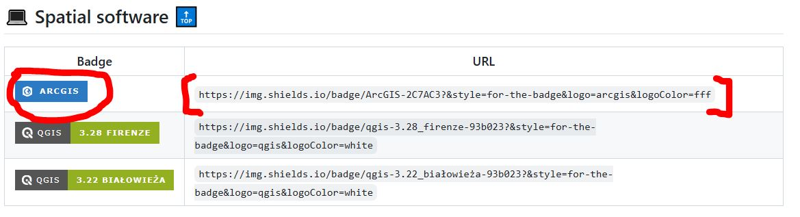

# Open Source Contributions

This repo lists all of my contributions to open-source projects and endeavours. Open-source projects are projects that are available for members of the public to duplicate and modify (with permission). This is a great way for people who would like to work in the data industry to gain expereince in contributing to projects, especially since many roles will involve working collaboratively in teams.

***UPDATED AS OF NOVEMBER 23, 2025***

# Table of Contents
* [Contributions on GitHub Repos](#contributions-on-github-repos)
  * [Completed](#-completed-)
  * [Ongoing](#-ongoing-)
* [Contributions on Ovio](#contributions-on-ovio)
  * [Completed](#-completed--1)
  * [Ongoing](#-ongoing--1)
* [Mapping Contributions](#mapping-contributions)
  * [Missing Maps](#missing-maps)
  * [OpenStreetMap](#openstreetmap)
---

# Contributions on GitHub Repos

Many repos on GitHub are open-source, meaning that GitHub members have the ability to suggest and contribute changes to a repo. Examples include, but are not limted to, debugging the source code, adding content to a README file, etc. To oversimplify the process of contributing to an open-source repo, one will first have to fork the repo (i.e., duplicate the repo into your own GitHub profile), make modifications to the duplicated repo, then request the owner of the original repo to make your desired modifications to the original repo (this is known as a pull request, where you are requesting the owner to merge your changes into the original repo). Of course, results may vary, and not all pull requests will be accepted.

***Updated as of November 23, 2025***

## ✅ Completed ✅

### Badges4-README.md-Profile

[Link to original repo](https://github.com/alexandresanlim/Badges4-README.md-Profile) | [Link to forked repo in my profile](https://github.com/Francis-Calingo/Badges4-README.md-Profile)

**Repo Info:** This repo serves as a place to find special-made badges for a wide variety of technical tools, ranging from programming languages (e.g., Python, Ruby) to communication tools (e.g., Gmail, MS Outlook) to Cloud technology (e.g., Azure, Oracle). These badges are special made for GitHub READMEs and can enhance the visual appeal of one's GitHub profile (see my profile repo for examples). 

**Tools/Languages Used:** Markdown

**Summary of Contribution:** The section "Spatial Software" did not include "ArcGIS", even though there exist a GitHub badge for ArcGIS. I therefore took it upon myself to fork the repo, add the badge, then submit a pull request.

**Impact:** The pull request was accepted, and is now part of the main repo. Users who have used ArcGIS and/or have working knowledge of it will now be able to use that badge template to add to their GitHub profile.

**Details of Contribution:**

Request to Add ArcGIS Badge to "Spatial software"

[Link to my pull request](https://github.com/alexandresanlim/Badges4-README.md-Profile/pull/771) | [Link to commit authored by repo owner, merging my pull request to the original repo](https://github.com/Francis-Calingo/Badges4-README.md-Profile/commit/21c48b499e8397af222ed54f96d98d505a2d92e2)

My suggested modification:

```diff
+ |                | `https://img.shields.io/badge/ArcGIS-2C7AC3?&style=for-the-badge&logo=arcgis&logoColor=fff`    |
```

Markdown code for the "Spatial Software" section after my modification:

```markdown
| Badge                                                                                                               | URL                                                                                                       |
| ------------------------------------------------------------------------------------------------------------------- | --------------------------------------------------------------------------------------------------------- |
|                | `https://img.shields.io/badge/ArcGIS-2C7AC3?&style=for-the-badge&logo=arcgis&logoColor=fff`    |
|     | `https://img.shields.io/badge/qgis-3.28_firenze-93b023?&style=for-the-badge&logo=qgis&logoColor=white`    |
|  | `https://img.shields.io/badge/qgis-3.22_białowieża-93b023?&style=for-the-badge&logo=qgis&logoColor=white` |
```

**Result:**



---

## 🚧 Ongoing 🚧

### how-to-contribute-to-open-source

[Link to original repo](https://github.com/freeCodeCamp/how-to-contribute-to-open-source) | [Link to forked repo in my profile](https://github.com/Francis-Calingo/how-to-contribute-to-open-source)

**Repo Info:** A repository made by FreeCodeCamp to help guide users in finding and meaningfully contributing to open-source projects.

**Tools/Languages Used:** Markdown

**Summary of Contribution:** The repo has guides in multiple languages, but do not have guides in the Tagalog and Ilocano languages.

**Projected Impact:** Tagalog and Ilocano translations will be provided for the repo. 

**Details of Contribution:**

**Result:**

### apd-core

[Link to original repo](https://github.com/awesomedata/apd-core) | [Link to forked repo in my profile](https://github.com/Francis-Calingo/apd-core)

**Repo Info:** A repository for publicly available free-to-use datasets.

**Tools/Languages Used:** Markdown

**Summary of Contribution:** The Government of Ontario's Open Data website will be added to the repo.

**Projected Impact:** 

**Details of Contribution:**

**Result:**

---

# Contributions on Ovio

Ovio is an online platform that connects developers with potential open-source contributors. In other words, it is a platform that allows one to contribute to real-world projects similar to how GitHub users can contribute to open-source repos.

***Updated as of November 23, 2025***

## ✅ Completed ✅

None as of November 23, 2025

---

## 🚧 Ongoing 🚧

### terrastories

[Ovio link to project]() | [Link to forked repo in my profile](https://github.com/Francis-Calingo/terrastories)


---

# Mapping Contributions

***Updated as of November 23, 2025***

## Missing Maps

Currently, I contribute to an app called [MapSwipe](https://mapswipe.org/en/blogs/2023-08-22-investing-in-mapswipe/). MapSwipe is an open-source online platform that allows users to contribute to mapping efforts worldwide. By finding, comparing, and validating maps and Earth imagery--which trains the algorithm into recognizing proper satellite imagery, the users have an immensely positive geospatial impact in the realm of data for good such as humanitarian relief.

[Link to my contribution statistics](https://community.mapswipe.org/user/nvxRJMNGAgYWsEr7nRCor8YYbTm2/)

Summary of contributions:

| Metric  | Score |
| ------------- | ------------- |
| Number of swipes  | 9903 |
| Total area swiped (sq. km)  | 3718 |
| Total projects  | 192 |
| Organizations supported  | 6  |


## OpenStreetMap

[Link to my contribution statistics](https://hdyc.neis-one.org/?FrancisEmmanuelCalingo)

Summary of contributions:

| Country  | Number of Changes |
| ------------- | ------------- |
| Canada | 2137 |
| Mexico | 310 |
| Japan  | 170 |
| Mozambique  | 129 |
| Philippines  | 64 |
| India  | 63 |
| East Timor  | 40 |
| South Korea  | 19 |
| Greece  | 8 |
| Vietnam  | 6 |
| Kenya  | 5 |
| Algeria  | 5 |
| Iran  | 5 |
| United States | 4 |
| Argentina  | 3 |
| Norway | 3 |
| United Kingdom  | 3 |
| Czech Republic  | 2 |
| Spain  | 1 |
